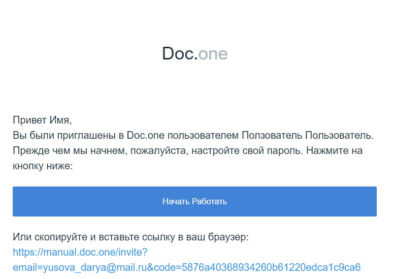
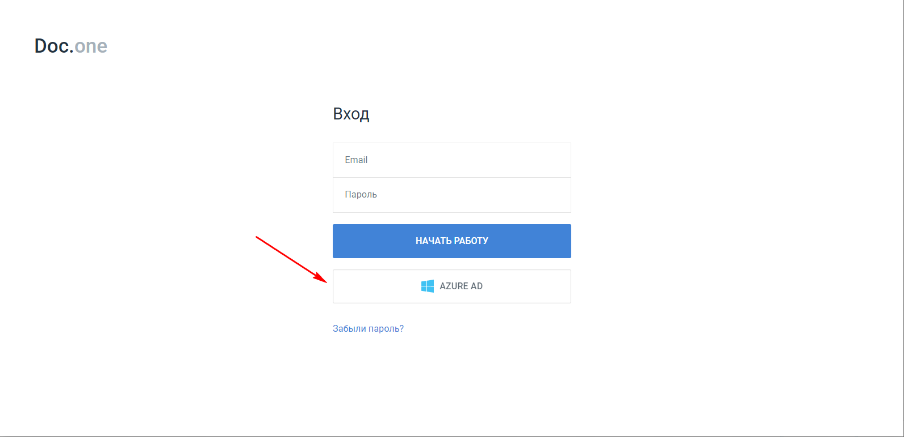

Регистрация и авторизация в Doc.one
===================================

Регистрация в Doc.one
---------------------
#. Попросите администратора отправить вам на email приглашение.
#. На вашу электронную почту придет письмо от Info@doc.one с темой **Invite**.
#. Перейдите по ссылке в письме для авторизации.

4. Установите пароль для входа в  Doc.one и нажмите кнопку **Отправить ссылку**.
#. Вы автоматически перейдете в главный раздел Doc.one.

Авторизация в Doc.one
---------------------
#. Откройте страницу авторизации в Doc.one. Адрес страницы авторизации можно взять в приглашении — это начало ссылки в письме.

.. figure:: _static/2020-09-01_153550.png
       :align: center
       :alt: Авторизация в Системе

2. Введите логин — email, на который вы получали приглашение, а также пароль, который вы создавали при регистрации.
#. Нажмите кнопку **НАЧАТЬ РАБОТУ**.
#. Вы автоматически перейдете в главный раздел Doc.one.

.. figure:: _static/autorization.gif
       :align: center
       :alt: Авторизация в Doc.one

5. Если в вашей компании настроен централизованный доступ через Microsoft Azure Active Directory, вы можете авторизоваться через MS Azure AD, нажав кнопку AZURE AD на странице входа.

